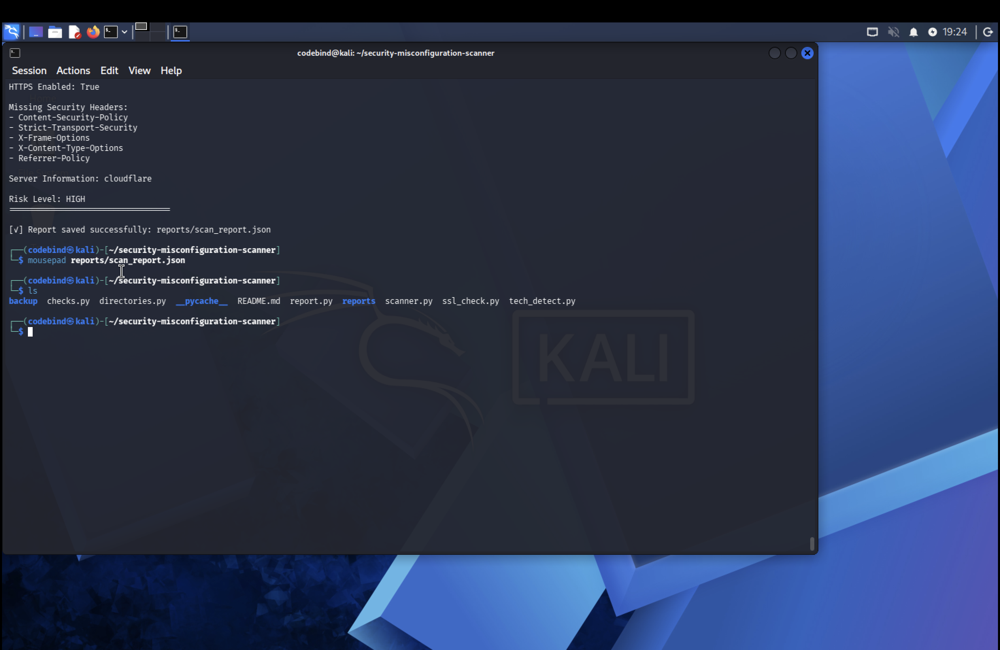
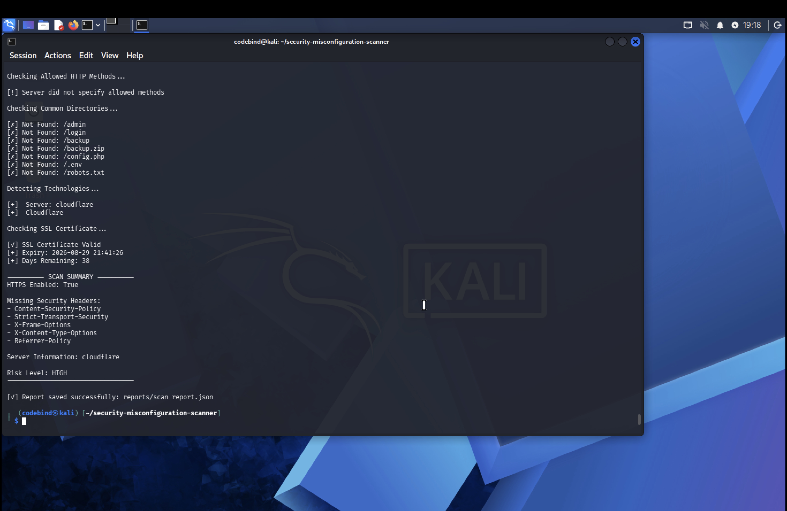
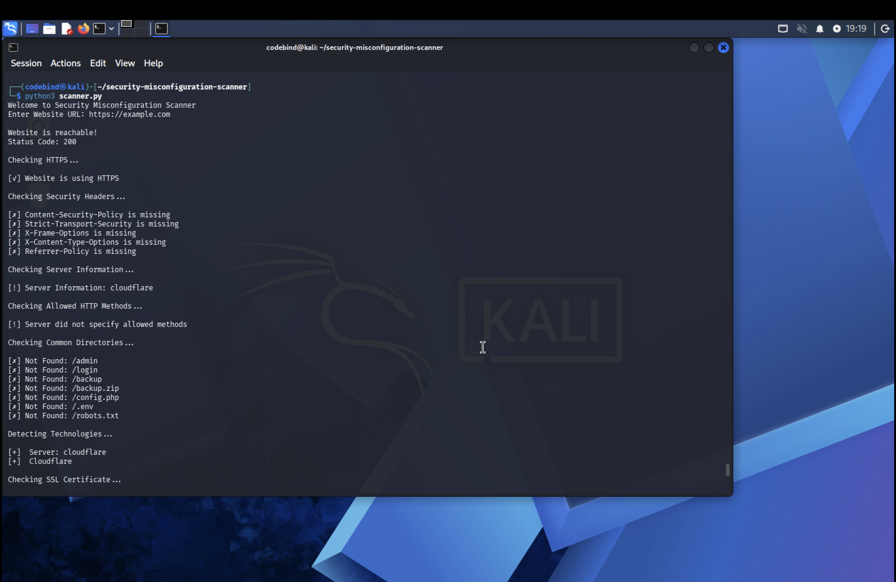

# 🔒 Security Misconfiguration Scanner

A Python-based security scanner that checks websites for common security misconfigurations such as missing security headers, HTTPS configuration, exposed directories, SSL certificate details, and technology detection.

---

## ✨ Features

- ✅ Website Reachability Check
- 🔒 HTTPS Verification
- 🛡️ Security Headers Analysis
- 🌐 Server Information Detection
- 📂 Common Directory Exposure Check
- 🔍 Technology Detection
- 📜 SSL Certificate Validation
- 📄 JSON Report Generation
- 📊 Risk Assessment Summary

---

## 🛠️ Technologies Used

- Python 3
- Requests
- SSL
- JSON
- Socket
- Git
- GitHub
- Kali Linux

---

## 📁 Project Structure

```
security-misconfiguration-scanner/
│── scanner.py
│── checks.py
│── ssl_check.py
│── directories.py
│── tech_detect.py
│── report.py
│── pdf_report.py
│── README.md
│── reports/
```

---

## 🚀 How to Run

Clone the repository:

```bash
git clone https://github.com/parveerchahal/security-misconfiguration-scanner.git
```

Go inside the project:

```bash
cd security-misconfiguration-scanner
```

Run the scanner:

```bash
python3 scanner.py
```

Enter the website URL when prompted.

---

# 📸 Project Screenshots

## ▶️ Running the Scanner

Shows the scanner analyzing the target website.



---

## 📋 Scan Summary

Displays detected security issues, missing headers, server details, and scan results.



---

## 📄 Generated JSON Report

Automatically generated report containing scan findings and risk assessment.



---

## 📂 Project Structure

Overview of the project files and folder organization.


---

# 🔮 Future Improvements

- PDF report generation
- GUI version
- Export reports in multiple formats
- Vulnerability severity scoring
- Additional security checks

---

## 👩‍💻 Author

**Parveer Kaur chahal**

Computer Science Engineering Student

Cybersecurity Trainee

Thapar Institute of Engineering & Technology

---

## ⭐ Support

If you found this project useful, consider giving it a ⭐ on GitHub.
